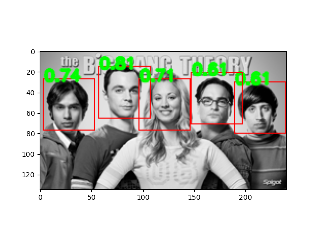

# Face Detection using a Histogram of Gradients
### Mohith Bhupalam, bhupalam.m@northeastern.edu

This repository uses a Histogram of Gradients (HOG) to detect faces in a target image.


Usage:
```
cd face-detection-hog
python3 HOG_ver1.py
```
Output image is written in file "output_HOG_face_detection.png" in the same directory.

A template image is used to construct the HOG, which is then matched to bounding boxes in the target image with the same shape as the template.

By default, 6 uniformly spaced bins are used to construct the histogram. For block normalization, we use a cell size of 8 pixels and a block size of 2x2.
Normalized Cross Correlation is used as a score between the template HOG and the bounding box's HOG.

**Dependencies:**
* Python 3.8.3
* Numpy 1.19.2
* OpenCV 4.5.1
* Matplotlib 3.3.2
* Skimage 0.17.2
